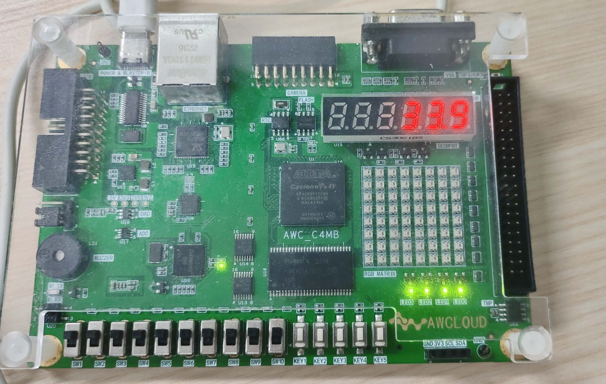

# DS18B20 数字温度传感器 (FPGA)

基于 **Altera Cyclone IV E (EP4CE6F17C8N)** 的 DS18B20 数字温度传感器驱动，实时温度显示在 6 位共阳极数码管的最右边 3 位，精确到小数点后一位。支持温度超出阈值时蜂鸣器播放音乐报警。

## 实物展示



## 版本

| 版本 | 日期 | 说明 |
|------|------|------|
| **v2.0** | 2026-06-16 | 新增蜂鸣器报警、KEY5静音切换、《晴天》旋律播放 |
| v1.0 | 2026-06-12 | DS18B20 驱动 + 6位数码管温度显示 |

## 硬件平台

| 项目 | 规格 |
|------|------|
| FPGA | EP4CE6F17C8N (Cyclone IV E) |
| 开发板 | AWC_C4MB_V11 |
| 时钟 | 50 MHz 板载晶振 |
| 数码管 | CS3061BH/S 6位共阳极 7段数码管 |
| 温度传感器 | DS18B20 (1-Wire 协议) |
| 开发工具 | Quartus Prime 18.0 Standard Edition |
| 仿真工具 | ModelSim (Verilog) |

## 引脚分配

| 信号 | FPGA 引脚 | 说明 |
|------|----------|------|
| `clk` | PIN_E1 | 50 MHz 系统时钟 |
| `rst_n` | PIN_E15 | 低电平复位 (KEY1) |
| `dq` | **PIN_E6** | DS18B20 1-Wire 数据线 |
| `buzzer` | **PIN_J1** | 无源蜂鸣器 PWM 驱动 |
| `key5` | **PIN_F8** | 低电平按键，外接上拉到 3.3V |
| `sel[5:0]` | B1, A2, B3, A3, B4, A4 | 数码管位选 (低有效) |
| `dig[7:0]` | A5, B8, A7, B6, B5, A6, A8, B7 | 数码管段选 (低有效) |

> **重要**: DS18B20 的 DQ 引脚 (PIN_E6) 需要外接 **4.7kΩ 上拉电阻到 3.3V**。传感器使用外部供电模式 (VDD 接 3.3V)。蜂鸣器为无源蜂鸣器，由 FPGA PWM 直接驱动。KEY5 外接上拉电阻到 3.3V，按下为低电平。

## 硬件连接

```
         VCC (3.3V)
           │
          ┌┤ 4.7kΩ
          ││
          ││
    ┌─────┴┴─────┬──────────────┐
    │            │              │
   DQ (E6)     VDD           GND
    │            │              │
   FPGA       DS18B20      DS18B20
```

## 数码管显示

6 位数码管布局 (共阳极, SEL 低有效):

```
 [空]  [空]  [空]  [2]  [5.]  [3]
 SEL0  SEL1  SEL2  SEL3  SEL4  SEL5
 ← 左侧              → 右侧
```

- **SEL5 (最右)**: 十分位 (小数位)
- **SEL4**: 个位 + 小数点
- **SEL3**: 十位 (前导零消隐)
- **SEL0~SEL2 (左3位)**: 不显示

示例:
- `25.3°C` → `_ _ _ 2 5. 3`
- `5.7°C` → `_ _ _ _ 5. 7`
- 无传感器 → `_ _ _ _ _ E`

## v2.0 新增功能

### 蜂鸣器报警

- **高温报警**: 温度 > 33.0°C 时蜂鸣器播放音乐
- **低温报警**: 温度 < 27.0°C 时蜂鸣器播放音乐
- **正常范围**: 27.0°C ~ 33.0°C 蜂鸣器静音
- **传感器断开**: 蜂鸣器不响（防止误报）
- **无源蜂鸣器**: J1 引脚输出 PWM 方波直接驱动

### KEY5 静音切换

- **按下 KEY5**: 切换静音状态（按下切换，再按恢复）
- 消抖时间 10ms，防止误触发
- 上电默认为非静音状态

### 《晴天》旋律播放

- 周杰伦《晴天》歌曲旋律
- 265 个音符，完整唱歌部分（已跳过前奏）
- 音符频率覆盖 C4~C5 (262 Hz ~ 523 Hz)
- 每个音符独立时长控制 (250 ms ~ 3000 ms)
- 播放完毕自动循环
- 采用 case 语句查表，综合为 LUT 逻辑

## 工作原理

### 1-Wire 协议时序

DS18B20 使用 Maxim/Dallas 1-Wire 单总线协议:

| 操作 | 低电平 | 释放/等待 | 说明 |
|------|--------|----------|------|
| 复位脉冲 | 500 µs | 70 µs | 检测传感器存在脉冲 |
| 写 "1" | 5 µs | 65 µs | 时隙总长 70 µs |
| 写 "0" | 60 µs | 10 µs | 时隙总长 70 µs |
| 读位 | 5 µs | 采样 @ 15 µs | 时隙总长 70 µs |

### 温度读取流程

```
复位 + 存在检测
    ↓
写 Skip ROM (0xCC)     ← 跳过地址匹配
    ↓
写 Convert T (0x44)    ← 启动温度转换
    ↓
等待 750 ms            ← 12位精度转换时间
    ↓
复位 + 存在检测
    ↓
写 Skip ROM (0xCC)
    ↓
写 Read Scratchpad (0xBE)  ← 读暂存器
    ↓
读温度 LSB (1字节)
    ↓
读温度 MSB (1字节)
    ↓
计算温度 (BCD) → 更新显示 → 循环
```

### 温度计算

DS18B20 12位温度寄存器格式 (有符号, LSB = 0.0625°C):

```
温度 (°C) = raw_temp / 16
显示值 (十分之一度) = (raw_temp × 10 + 8) / 16
```

示例: 25.0°C → raw = 0x0190 → `temp_tenths = 250` → 显示 `25.0`

## 项目文件

| 文件 | 说明 |
|------|------|
| `ds18b20.v` | 顶层模块 (DS18B20 驱动 + 数码管显示 + 蜂鸣器报警 + 音乐播放) |
| `ds18b20_tb.v` | 仿真测试平台 (含 1-Wire 从机行为模型) |
| `ds18b20.qpf` | Quartus Prime 项目文件 |
| `ds18b20.qsf` | 引脚分配 & 工程设置 |

## 许可

MIT License
